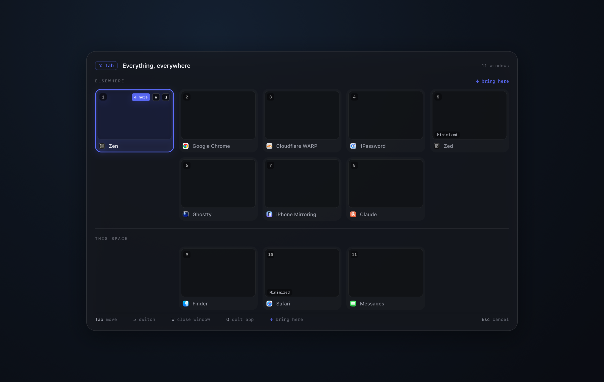

<div align="center">

# ZenTab

### Window switching that feels instant.

A calm, instant window switcher for **macOS** and **Windows**. Tap to land in the
window you want, or hold and every window steps gently into view while the rest of
the world recedes.

[](#download)
[](LICENSE)
[](#download)
[](https://yasinuslu.github.io/zentab/)

**[Download](#download)** · **[Try the live overlay](https://yasinuslu.github.io/zentab/overlay)** · **[Website](https://yasinuslu.github.io/zentab/)** · **[Vision](VISION.md)**

<br>



</div>

---

ZenTab is the alt-tab I always wanted: opinionated, instant, and the same on every OS I
refuse to leave. Years of a great Linux switching experience that neither macOS nor
Windows ever matched (the [full origin story](darwin/README.md#why-zentab-exists) is in
the macOS readme) turned into one product with two native builds:

- **macOS** in Swift / AppKit, on private SkyLight + Accessibility APIs.
- **Windows** in C# / WPF on .NET 10, on a thin Win32/DWM interop layer.

Same vision, same brand, native guts on each OS. It replaces your system switcher, ships
with strong defaults, and keeps the little it needs in one file you own.

## Why it feels different

- **Very opinionated.** One considered path, chosen for you. The switching behavior is the product, and it is not up for debate.
- **No settings.** No knobs, nothing to fiddle with. The calm comes from having nothing to tune (only the trigger keys live in a file).
- **Free forever.** No Pro tier, no license server, no nag. For everyone, always.
- **Featherlight.** Resident all day, effectively invisible until summoned: near-zero CPU, GPU, and memory at idle.
- **Minimal and calm.** A soft 80 to 120 ms fade at the monitor's real refresh rate. Quiet motion, quiet chrome, full focus.

The whole point is the **feel**: a switch that stutters can't feel calm, and one that
feels calm is, by definition, fast. Feel and performance are one goal, and every choice is
judged against both.

## Three modes

Three modes, hard-coded behavior, on both platforms. Only the trigger keys are configurable.

| Mode | Shows | Scope | macOS | Windows |
| --- | --- | --- | --- | --- |
| **Everyday switch** | every window here | current monitor + desktop | `⌘ Tab` | `Alt Tab` |
| **Current-app windows** | every window of the active app | all desktops + monitors (incl. minimized) | `⌘ \`` | `Alt \`` |
| **Global escape hatch** | everything, everywhere | all apps, desktops, monitors | `⌥ Tab` | `Ctrl Alt Tab` |

- **Tap** (press and release): instant switch to the most-recent other window. No overlay, no lag.
- **Hold**: the overlay appears with a **stable** list (Slack is always 4th), so your hand builds muscle memory instead of chasing a reshuffling list.
- In the overlay: **Tab** / **Shift+Tab** or the mouse to navigate, release to commit, click outside to cancel, **W** to close a window, **Q** to quit its app.

See **[VISION.md](VISION.md)** for the full behavior spec and **[BRANDING.md](BRANDING.md)**
for the shared visual identity (the always-dark spotlight, the Electric `#5D6DFF` accent).

## Download

| Platform | Get it | Requirements |
| --- | --- | --- |
| **macOS** | [Download `.dmg`](https://cdn.nepjua.org/zentab/macos/releases/latest/ZenTab.dmg) | Universal, macOS 13+ |
| **Windows** | [Download portable `.exe`](https://cdn.nepjua.org/zentab/windows/releases/latest/ZenTab-win-x64-portable.exe) | Windows 10 / 11 |

Prefer to watch it move first? **[Try the playable overlay in your browser](https://yasinuslu.github.io/zentab/overlay)** (no install).

macOS needs Accessibility (mandatory) and Screen Recording (for live thumbnails). Interim
builds are ad-hoc signed, so Gatekeeper shows a warning until notarization lands.

## Build from source

One repo, two apps. Each has its own README with the full details.

```
darwin/    macOS app (Swift)    -> see darwin/README.md
windows/   Windows app (C#/WPF) -> see windows/README.md
website/   marketing site + live overlay demo (Bun + Vite + React)
```

- **macOS**: work from `darwin/`, build/run with `bin/run`, `bin/build`, `bin/test`. `project.yml` is the source of truth (regenerate the Xcode project with `bin/generate`).
- **Windows**: work from `windows/`, build/run with `dotnet run`, `./dev.ps1`, `./build.ps1`.

The shared `VISION.md`, `BRANDING.md`, `CLAUDE.md`, and `LICENSE` live at the root; each app
keeps a platform-specific README in its folder.

<details>
<summary><b>CI &amp; releases</b></summary>

Workflows are path-scoped: a `darwin/**` change runs only the macOS jobs, a `windows/**`
change only the Windows jobs.

- `*-ci.yml`: build + test on PRs and pushes to `main`.
- `*-main.yml`: on every push to `main`, overwrite the rolling "latest from main" bundles on R2.
- `*-release.yml`: on a version tag, upload versioned + "latest stable" bundles to R2 and cut a notes-only GitHub Release.

Release tags are namespaced per platform so they don't collide:

```
git tag darwin-v0.1.0  && git push origin darwin-v0.1.0     # cuts a macOS release
git tag windows-v0.2.0 && git push origin windows-v0.2.0    # cuts a Windows release
```

Bundles ship to the `nepjua-cdn` Cloudflare R2 bucket (`cdn.nepjua.org`) under `zentab/`,
not to GitHub assets. Versioned files cache hard (immutable); rolling "latest"/"main" files
are served `no-cache`. Uploads go through `darwin/bin/r2-publish` / `windows/r2-publish.ps1`,
driven by the `R2_API_URL`, `R2_ACCESS_KEY_ID`, and `R2_SECRET_ACCESS_KEY` secrets.

</details>

## License

The whole repository, both apps, is **GPL-3.0** (single root [`LICENSE`](LICENSE)): the same
license as [alt-tab-macos](https://github.com/lwouis/alt-tab-macos), the project ZenTab
learns from, which clears porting its window-engine techniques. Use, study, modify, and
redistribute under the same terms.
